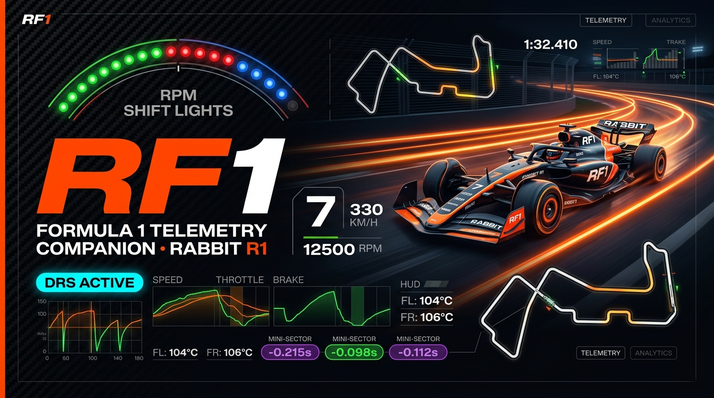
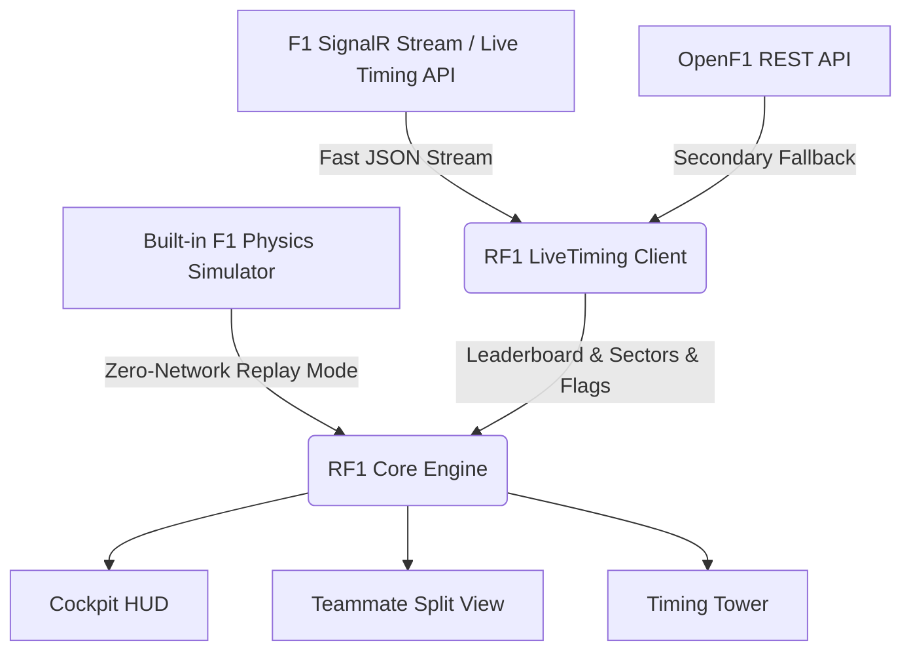

<div align="center">



# 
### Dedicated Formula 1 Pit-Wall Telemetry Companion for Rabbit R1

[](https://github.com/rabbit-hmi-oss/creations-sdk)
[](https://anxand.github.io/RF1/)
[](https://github.com/AnxAnd/RF1)
[](LICENSE)

<p align="center">
  <b>Engineered specifically for the Rabbit R1's tactile mechanical hardware:</b><br/>
  Notched physical scroll wheel (<code>scrollUp</code>/<code>scrollDown</code>), side push-to-talk button (<code>sideClick</code>), and 240×282 pixel display.
</p>

</div>

---

## 📖 Overview

**RF1** turns your **Rabbit R1** into a dedicated Formula 1 pit-wall telemetry console. Prop it on your desk, nightstand, or coffee table alongside your Grand Prix broadcast to monitor real-time car telemetry, head-to-head constructor battles, sector split colors, live delta intervals, and race flags with zero lag.

RF1 connects directly to high-frequency live timing telemetry streams, rendering telemetry at native 240×282 resolution without viewport clipping or scrollbars.

---

## 📲 Install on Rabbit R1 (Instant Scan)

Point your Rabbit R1 camera at the QR code below to launch **RF1** instantly:

<div align="center">
  
  <p><b>Scan with Rabbit R1 camera to open app</b></p>
  <p>Live Web App: <code>https://anxand.github.io/RF1/</code></p>
</div>

---

## 🌟 The Four Main App Views

Navigate effortlessly using the **Side PTT Button** or the persistent bottom navigation tabs:

```
[RACES] ◀────── (Side Button / Nav Bar) ──────▶ [HUD] ◀──────▶ [SPLIT] ◀──────▶ [TOWER]
```

---

### 🏭 1. Manufacturer & Teammate Split View (`SPLIT`)
> *The ultimate pit-wall telemetry comparison between constructor teammates.*

The **Manufacturer Split View** provides an in-depth, side-by-side performance analysis of both drivers for any constructor on the grid (e.g., McLaren `NOR` vs `PIA`, Red Bull `VER` vs `HAD`, Ferrari `LEC` vs `HAM`, Mercedes `RUS` vs `ANT`, Cadillac `PER` vs `BOT`).

```
┌────────────────────────────────────────────────────────┐
│ ◀ ▌ MCLAREN     ▶   │  Δ +0.840s  │  SINGAPORE GP     │
├──────────────────────────┬─────────────────────────────┤
│ NOR                  P1  │ PIA                     P4  │
│ [BEST]         1:33.400  │ [BEST]            1:34.240  │
│ ┌───────┬───────┬──────┐ │ ┌───────┬───────┬─────────┐ │
│ │S1 33.5│S2 45.2│S3 36.3 │ │S1 33.8│S2 45.5│S3 36.5  │ │
│ │PURPLE │ GREEN │PURPLE│ │ │ GREEN │ GREEN │ YELLOW  │ │
│ └───────┴───────┴──────┘ │ └───────┴───────┴─────────┘ │
│ GEAR                  7  │ GEAR                     7  │
│ SPD                 310  │ SPD                    306  │
│       [DRS OFF]          │        [DRS ACTIVE]         │
│  [BRK: 0%] [THR: 100%]   │   [BRK: 0%] [THR: 95%]      │
│  (M) 12 Laps             │   (H) 18 Laps               │
└──────────────────────────┴─────────────────────────────┘
```

#### Key Capabilities in Split View:
* **Best Lap Comparison**: Dedicated `BEST` lap time badge for each teammate displaying their quickest lap of the session down to the thousandth of a second.
* **Teammate Lap Delta (`Δ`)**: Prominent top delta pill computing the exact lap time differential between teammates (e.g., `Δ +0.840s`), matching official F1 broadcast graphics.
* **Official F1 TV Broadcast Sector Colors (S1, S2, S3)**:
  * 🟣 **Purple (`.sector-purple`)**: **Overall Session Fastest** — The quickest time recorded across all drivers in that sector.
  * 🟢 **Green (`.sector-green`)**: **Personal Best** — The driver's personal fastest time in that sector.
  * 🟡 **Yellow (`.sector-yellow`)**: **Slower / No Improvement** — Regular sector time with no personal improvement.
  * ⚪ **Neutral (`.sector-none`)**: In-pit or out-lap without a valid timed split.
* **Real-Time Telemetry Traces**:
  * **Gear indicator** (`1`–`8`, `N`)
  * **Digital Speedometer** in `KM/H`
  * **DRS Flap Indicator** (glowing cyan when open and deployed)
  * **Proportional Pedal Meters**: Live dual vertical bars showing real-time Brake (neon red) and Throttle (electric green) percentages
  * **Tyre Compound & Stint Age**: Official compound badges (`S` Soft, `M` Medium, `H` Hard, `I` Intermediate, `W` Wet) plus stint lap counts.
* **Effortless Manufacturer Switching**:
  * Tap the **`◀` Previous** or **`▶` Next** arrow buttons.
  * Tap the **Manufacturer Title** to advance to the next team.
  * Roll the Rabbit R1's **physical notched scroll wheel**.
  * Use natural **horizontal touch swipe gestures** across the screen.
* **Driver Focus**: Tapping either teammate's telemetry column instantly jumps into their individual **Cockpit HUD**.

---

### 🏁 2. Cockpit Telemetry HUD (`HUD`)
> *Driver's steering wheel cockpit display with RPM shift lights and circuit watermark.*

* **12-LED Progressive Shift Lights**:
  * **4 Green LEDs**: Low rev range (0–55% RPM)
  * **4 Red LEDs**: Optimal power band (55–85% RPM)
  * **4 Blue/Purple LEDs**: Approaching redline (85–100% RPM, flashing violently at the rev limiter)
* **High-Contrast Central Cluster**:
  * Giant numerical **Gear readout** with luminous edge glow.
  * Digital **Speedometer** in `KM/H`.
  * **Dynamic DRS Status Pill**: Inactive dark badge illuminates in neon cyan (`#00F5D4`) when the rear-wing flap opens in a DRS activation zone.
* **Glowing Circuit Watermark**:
  * Subtle glowing vector outline of the active circuit layout sits directly behind the cockpit gauges.
* **Cockpit Footer**:
  * Proportional vertical pedal columns (`BRK` 0–100% and `THR` 0–100%).
  * Tyre compound badge and stint wear counter.
  * Lap counter showing current lap vs total race distance (e.g. `L 18/62`).
* **Non-Intrusive Driver Header**:
  * Displays 2026 driver numbers (e.g., `NOR 1`, `VER 3`, `PIA 81`), driver surname, position badge (`P1`), and gap to the car ahead (`LEADER` or `+1.263s`).

---

### 📊 3. Race Timing Tower (`TOWER`)
> *Live 22-car race classification and timing intervals across all 11 constructor teams.*

* **Full Grid Standings**: Instant visibility of the entire grid ordered by track position (`P1` to `P22`).
* **Constructor Livery Stripes**: High-visibility team color bars next to each driver abbreviation (`NOR`, `VER`, `LEC`, `HAM`, `PIA`, `RUS`, etc.).
* **Timing & Gap Intervals**: Real-time delta to leader or car ahead (`LEADER`, `+2.450s`), plus pit status indicators (`IN PIT`, `OUT LAP`).
* **Tyre Compounds**: Clear circular compound badges (`S`, `M`, `H`, `I`, `W`) displaying each car's current rubber.
* **One-Tap Driver Focus**: Tap any driver in the timing tower to instantly switch into their individual Cockpit HUD!

---

### 🗓️ 4. Race & Season Selector (`RACES`)
> *Switch between live race streaming and iconic historical Grand Prix replays.*

* **Live Grand Prix Mode**:
  * Connects to live session feeds for current race weekends.
  * **Track Inactive Detection**: If selected when no cars are running, RF1 displays an informative screen noting track status and scheduled broadcast session times.
* **Curated Replay Catalogue (9 Iconic Circuits)**:
  * **2026**: Singapore GP (Marina Bay Street Circuit)
  * **2024**: British GP (Silverstone), Austrian GP (Red Bull Ring), Abu Dhabi GP (Yas Marina)
  * **Classic Tracks**: Monaco GP (Circuit de Monaco), Belgian GP (Spa-Francorchamps), Italian GP (Monza), Japanese GP (Suzuka), São Paulo GP (Interlagos)
* **Season Filter Pills**: Filter races quickly with **`ALL`**, **`2026`**, **`2024`**, and **`CLASSIC`** tags.
* **Restart from Lap 1**: Dedicated reset button to restart any race replay back to Lap 1 with fresh tyres and starting grid order.

---

### 🚩 5. Race Control Flag Alerts
> *Real-time safety and race control warnings with cockpit perimeter alerts.*

RF1 listens to official FIA race control messages and triggers instant visual warnings:
* 🟢 **GREEN FLAG**: Track clear / racing resumed.
* 🟡 **YELLOW FLAG**: Hazard on track / sector caution.
* 🟡 **DOUBLE YELLOW**: Extreme caution / track obstructed.
* 🟠 **SAFETY CAR (SC) / VIRTUAL SAFETY CAR (VSC)**: Controlled speed delta enforced.
* 🔴 **RED FLAG**: Session suspended.
* 🏁 **CHEQUERED FLAG**: Session completed / race finish.

*Smart UI Placement*: Flag banners are positioned to never obscure the driver name or critical gauges. Banners can be dismissed with a tap, and automatically reappear if the flag condition changes.

---

## 🏎️ 2026 Formula 1 Driver Grid & Constructors

RF1 features the updated official **2026 World Championship grid** (11 constructor teams, 22 drivers):

| Car # | Driver | Code | Team / Constructor | Team Color |
|:---:|:---|:---:|:---|:---:|
| **1** | Lando Norris | `NOR` | McLaren | 🟧 Papaya Orange |
| **81** | Oscar Piastri | `PIA` | McLaren | 🟧 Papaya Orange |
| **3** | Max Verstappen | `VER` | Red Bull Racing | 🟦 Dark Navy Blue |
| **6** | Isack Hadjar | `HAD` | Red Bull Racing | 🟦 Dark Navy Blue |
| **16** | Charles Leclerc | `LEC` | Ferrari | 🟥 Scarlet Red |
| **44** | Lewis Hamilton | `HAM` | Ferrari | 🟥 Scarlet Red |
| **63** | George Russell | `RUS` | Mercedes | 🟩 Petronas Cyan |
| **12** | Kimi Antonelli | `ANT` | Mercedes | 🟩 Petronas Cyan |
| **14** | Fernando Alonso | `ALO` | Aston Martin | 🟩 Racing Green |
| **18** | Lance Stroll | `STR` | Aston Martin | 🟩 Racing Green |
| **10** | Pierre Gasly | `GAS` | Alpine | 🟦 Alpine Blue |
| **43** | Franco Colapinto | `COL` | Alpine | 🟦 Alpine Blue |
| **23** | Alexander Albon | `ALB` | Williams | 🟦 Williams Blue |
| **55** | Carlos Sainz | `SAI` | Williams | 🟦 Williams Blue |
| **27** | Nico Hülkenberg | `HUL` | Audi / Sauber | 🟩 Neon Green |
| **5** | Gabriel Bortoleto | `BOR` | Audi / Sauber | 🟩 Neon Green |
| **30** | Liam Lawson | `LAW` | Racing Bulls | 🟦 Royal Blue |
| **41** | Arvid Lindblad | `LIN` | Racing Bulls | 🟦 Royal Blue |
| **31** | Esteban Ocon | `OCO` | Haas F1 Team | ⬜ Haas White/Red |
| **87** | Oliver Bearman | `BEA` | Haas F1 Team | ⬜ Haas White/Red |
| **11** | Sergio Perez | `PER` | Cadillac F1 Team | ⚪ Platinum Silver |
| **77** | Valtteri Bottas | `BOT` | Cadillac F1 Team | ⚪ Platinum Silver |

---

## 🕹️ Rabbit R1 Hardware Controls

Every feature in RF1 is tailored around the physical ergonomics of the Rabbit R1:

| Hardware Control | Event | In Races View | In Cockpit HUD | In Teammate Split | In Timing Tower |
|:---|:---:|:---|:---|:---|:---|
| **Scroll Wheel Down** | `scrollDown` | Scroll race list | Next driver | Next manufacturer team | Next driver |
| **Scroll Wheel Up** | `scrollUp` | Scroll race list | Previous driver | Previous manufacturer team | Previous driver |
| **Side Button (PTT)** | `sideClick` | Cycle to **HUD** | Cycle to **SPLIT** | Cycle to **TOWER** | Cycle to **RACES** |
| **Touch: Prev/Next Arrows** | `click` | — | — | Cycle team (`◀` / `▶`) | — |
| **Touch: Manufacturer Title**| `click` | — | — | Cycle team (`+1`) | — |
| **Touch: Swipe Left/Right** | `touchmove`| — | — | Cycle team forward/back | — |
| **Touch: Driver Column** | `click` | — | — | Focus driver & jump to HUD | — |
| **Touch: Leaderboard Row** | `click` | — | — | — | Focus driver & jump to HUD |
| **Touch: Circuit Badge** | `click` | Open Race Selector | Open Race Selector | Open Race Selector | Open Race Selector |
| **Touch: Bottom Nav Tabs** | `click` | Direct jump (`RACES`, `HUD`, `SPLIT`, `TOWER`) | Direct jump | Direct jump | Direct jump |

---

## ⚡ Architecture & Live Data Feeds

RF1 implements a robust, multi-tier data pipeline:



1. **Official F1 SignalR Timing Stream**: Connected through the lightweight `f1-livetiming-api` server, extracting `BestLapTime`, multi-sector timing objects (`Sectors[0..2]`), tyre compound stints, and race control flags in real time with **no rate limits**.
2. **OpenF1 Authentication Fallback**: Secondary support for OpenF1 API keys when connected to legacy endpoints.
3. **Autonomous Physics Engine**: When offline or in Replay mode, RF1 runs an internal, deterministic telemetry simulation that models throttle traces, brake points, gear shifts, tyre degradation, and sector deltas across 9 world championship circuits.

---

## 🛠️ Local Development & Testing

You can run and test RF1 locally on any browser or preview device:

```bash
# 1. Clone repository
git clone https://github.com/AnxAnd/RF1.git
cd RF1

# 2. Launch preview server
./launch-preview.sh

# Or run with Node:
npm start
```

### Keyboard & Mouse Simulation for Rabbit R1 Hardware:
* **Mouse Scroll Wheel** or **`↑` / `↓` Arrow Keys**: Simulates the Rabbit R1 mechanical scroll wheel (`scrollUp` / `scrollDown`).
* **`Spacebar`** or **`P` Key**: Simulates the Rabbit R1 side push-to-talk button (`sideClick`).
* **Locked Resolution**: Default viewport is pinned to **240 × 282** CSS pixels to match the Rabbit R1 screen.

---

## 📄 License

MIT License — Copyright (c) 2026 [AnxAnd](https://github.com/AnxAnd).
Code released for the rabbitOS and Formula 1 community.
